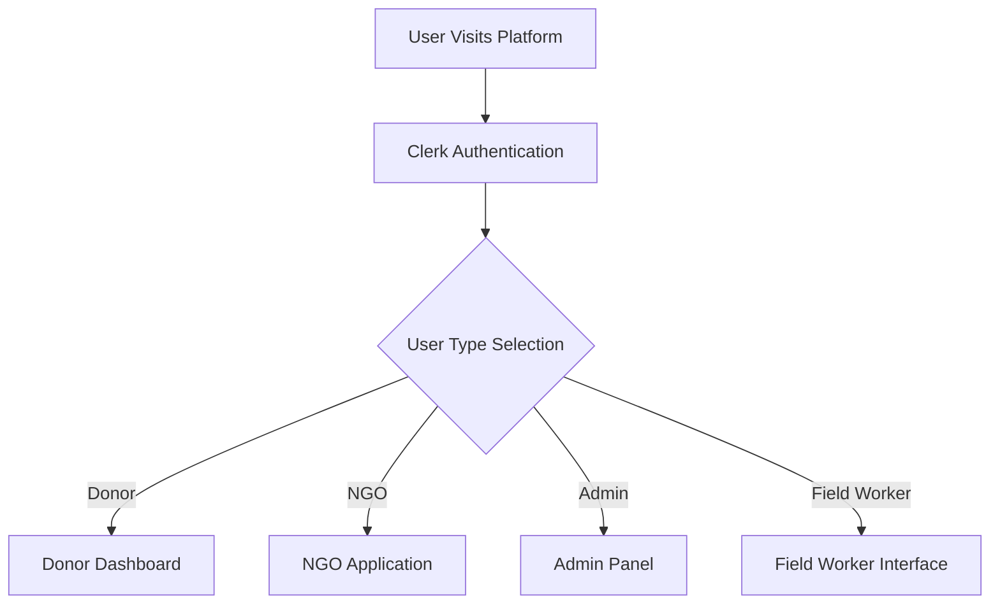

# AidVerify - AI-Powered Transparent Aid Distribution Platform

**Blockchain-based humanitarian aid platform with AI-powered face recognition and fraud prevention**

## 💡 Inspiration
Fraud and lack of transparency have long affected humanitarian aid systems — donations often fail to reach real beneficiaries.  
We were inspired to build **AidVerify**, a platform that restores **trust, accountability, and fairness** in aid distribution using **AI and blockchain**.

---

## 🚧 Challenges We Faced
- **Face Recognition on Mobile:** Poor lighting and camera angles caused false verifications.  
  🔧 *Fix:* Added image preprocessing, liveness checks, and threshold tuning.  
- **NGO Claim Verification:** Inconsistent documents and limited public data.  
  🔧 *Fix:* Used OCR with fuzzy matching and online source validation.  
- **Blockchain Integration:** Ensuring transaction sync between backend and smart contracts.  
  🔧 *Fix:* Added asynchronous event listeners and transaction retries.  
- **Performance Optimization:** Handling AI inference and API responses efficiently.  
  🔧 *Fix:* Used ONNX Runtime for faster model inference and caching results.

---

## 🏆 Accomplishments
- Built a **working prototype** that connects donors, NGOs, and beneficiaries.  
- Integrated **AI face verification** with **blockchain transparency** successfully.  
- Developed a **document verification pipeline** for NGO authenticity.  
- Ensured **end-to-end traceability** for aid distribution transactions.

---

## 📚 What We Learned
- How **AI + Blockchain** can jointly create real-world trust systems.  
- Importance of **data quality** in identity verification models.  
- Need for **liveness detection** and **multi-source validation** to prevent misuse.  
- Value of designing solutions that combine **social impact with technology**.

---

## 🚀 What's Next
- Integrate **government KYC APIs** for deeper verification.  
- Partner with **international NGOs** and aid organizations.  
- Launch a **mobile app** for real-time field verification.  
- Explore **multi-chain deployment** for scalability and low transaction fees.

---

## 🏗️ Project Architecture

```
AIDVERIFY/
├── 📱 frontend/                    # React 19 + Vite Frontend
│   ├── src/
│   │   ├── components/            # Reusable UI components
│   │   │   ├── ui/               # Radix UI components
│   │   │   └── magicui/          # Custom animated components
│   │   ├── pages/                # Route-based page components
│   │   │   ├── Admin/            # Admin dashboard & management
│   │   │   ├── Campaign/         # Campaign details & management
│   │   │   ├── Crowdfunding/     # Crowdfunding interface
│   │   │   ├── DonorDashboard/   # Donor analytics & history
│   │   │   ├── FieldWorker/      # Field worker verification
│   │   │   ├── Home/             # Campaign discovery
│   │   │   ├── Landing/          # Public landing page
│   │   │   ├── NgoApplication/   # NGO registration
│   │   │   ├── NgoDashboard/     # NGO management portal
│   │   │   └── Payment/          # Payment processing
│   │   ├── auth/                 # Clerk authentication
│   │   └── utils/                # API utilities & helpers
│   └── package.json              # Dependencies & scripts
│
├── 🔧 backend/                     # Node.js + Express API Server
│   ├── config/                   # Configuration files
│   │   ├── cloudinary.js         # Media storage config
│   │   └── multerConfig.js       # File upload middleware
│   ├── contractcontroller/       # Blockchain integration
│   │   ├── CampaignManagerController.js
│   │   ├── DonationManagerController.js
│   │   └── contractDeployer.js
│   ├── controllers/              # Business logic controllers
│   │   ├── AdminController.js    # Admin operations
│   │   ├── crowdfundingController.js
│   │   ├── fundUtilizationController.js
│   │   ├── ngoApplicationController.js
│   │   ├── ocrController.js      # Document processing
│   │   ├── tokenRewardController.js
│   │   └── transactionController.js
│   ├── models/                   # MongoDB schemas
│   │   ├── Crowdfunding.js
│   │   ├── FundUtilization.js
│   │   ├── NgoApplication.js
│   │   ├── TokenReward.js
│   │   ├── Transaction.js
│   │   └── User.js
│   ├── routes/                   # API route definitions
│   ├── services/                 # External service integrations
│   │   └── NgoMailService.js
│   └── server.js                 # Express server entry point
│
├── 🤖 face_verify/                 # Python FastAPI Face Recognition
│   ├── 310venv/                  # Python virtual environment
│   ├── app/
│   │   ├── api/                  # API route handlers
│   │   ├── core/                 # Core configuration
│   │   ├── models/               # ML model definitions
│   │   ├── services/             # Face recognition services
│   │   └── main.py               # FastAPI application
│   ├── data/
│   │   └── embeddings.json       # Face embedding storage
│   ├── models/                   # YOLO detection models
│   │   ├── yolo11n.pt
│   │   └── yolov8n.pt
│   └── requirements.txt          # Python dependencies
│
├── 🔗 blockchain/                  # Ethereum Smart Contracts
│   ├── contracts/                # Solidity smart contracts
│   │   ├── CampaignManager.sol   # Campaign lifecycle management
│   │   ├── DonationManager.sol   # Donation processing
│   │   ├── DonorManager.sol      # Donor management
│   │   └── NgoManager.sol        # NGO verification
│   ├── migrations/               # Deployment scripts
│   ├── artifacts/                # Compiled contract artifacts
│   └── truffle-config.js         # Truffle configuration
│
└── 🔍 Ngo_Claim_Verification/      # AI NGO Verification Service
    ├── app/
    │   ├── core/                 # Core verification logic
    │   ├── routes/               # API endpoints
    │   ├── utils/                # Utility functions
    │   └── main.py               # FastAPI application
    ├── config/
    │   └── weights.json          # ML model weights
    └── requirements.txt          # Python dependencies
```

## 🚀 Technology Stack

### Frontend Technologies
| Technology | Version | Purpose |
|------------|---------|---------|
| **React** | 19.1.1 | Modern UI framework with concurrent features |
| **Vite** | 7.1.2 | Lightning-fast build tool and dev server |
| **Tailwind CSS** | 4.1.12 | Utility-first CSS framework |
| **Radix UI** | Latest | Accessible, unstyled UI components |
| **Clerk** | 5.45.0 | Authentication and user management |
| **React Router** | 7.8.2 | Client-side routing |
| **Axios** | 1.11.0 | HTTP client for API requests |
| **Lucide React** | 0.541.0 | Beautiful icon library |
| **GSAP** | 3.13.0 | High-performance animations |
| **Recharts** | 3.1.2 | Data visualization charts |

### Backend Technologies
| Technology | Version | Purpose |
|------------|---------|---------|
| **Node.js** | Latest | JavaScript runtime environment |
| **Express.js** | 5.1.0 | Web application framework |
| **MongoDB** | Latest | NoSQL document database |
| **Mongoose** | 8.17.1 | MongoDB object modeling |
| **Ethers.js** | 6.15.0 | Ethereum blockchain interaction |
| **Cloudinary** | 2.7.0 | Cloud-based media management |
| **Tesseract.js** | 6.0.1 | OCR text recognition |
| **Nodemailer** | 7.0.5 | Email service integration |
| **JWT** | 9.0.2 | JSON Web Token authentication |
| **Multer** | 2.0.2 | File upload middleware |

### AI/ML Services
| Technology | Version | Purpose |
|------------|---------|---------|
| **FastAPI** | 0.100.0+ | High-performance Python web framework |
| **InsightFace** | 0.7.3+ | State-of-the-art face recognition |
| **OpenCV** | 4.8.0+ | Computer vision library |
| **ONNX Runtime** | 1.15.0+ | Cross-platform ML inference |
| **YOLO** | v8/v11 | Real-time object detection |
| **Scikit-Image** | 0.20.0+ | Image processing algorithms |
| **NumPy** | 1.21.0+ | Numerical computing |

### Blockchain Technologies
| Technology | Version | Purpose |
|------------|---------|---------|
| **Solidity** | 0.8.18 | Smart contract programming language |
| **Truffle** | Latest | Development framework for Ethereum |
| **Ganache** | Latest | Personal blockchain for development |
| **Web3.js** | Latest | Ethereum JavaScript API |

## 📊 Database Schema

### MongoDB Collections

#### NgoApplication Schema
```javascript
{
  ngoName: String,
  registrationNumber: String,
  ngoID: String,
  website: String,
  contactPerson: String,
  designation: String,
  email: String,
  phone: String,
  campaignTitle: String,
  tagline: String,
  category: String,
  location: String,
  startDate: String,
  endDate: String,
  description: String,
  beneficiaries: String,
  goalAmount: Number,
  receivedAmount: Number,
  campaignID: String,
  story: String,
  outcomes: String,
  accountNumber: String,
  ifscCode: String,
  bankName: String,
  documents: {
    ngoCertificate: String,
    financialStatement: String,
    idProof: String,
    fieldImages: String,
    cancelledCheque: String
  },
  terms: Boolean,
  authenticity: Boolean,
  signature: String,
  AdminApproval: String, // "pending", "approved", "rejected"
  AIApproval: String,    // "pending", "approved", "rejected"
  timestamps: true
}
```

#### Transaction Schema
```javascript
{
  transactionId: String,
  amount: Number,
  campaignId: String,
  donorId: String,
  donorBlockchainId: String,
  donorEmail: String,
  donorName: String,
  paymentMethod: String,
  status: String, // "pending", "completed", "failed"
  paymentProofPic: String,
  paymentProofHash: String,
  paymentProofHashPic: String,
  timestamps: true
}
```

## 🔐 Smart Contract Architecture

### CampaignManager.sol
```solidity
struct Campaign {
    bytes32 Campaign_id;
    string title;
    string description;
    string location;
    string ngo;
    uint256 targetAmount;
    uint256 totalReceived;
    bool isActive;
}

// Key Functions:
- createCampaign()
- getCampaign()
- closeCampaign()
- getAllCampaignID()
- getCampaignsByNgo()
```

### DonationManager.sol
- Handles donation processing
- Manages fund transfers
- Tracks donation history
- Implements milestone-based releases

### NgoManager.sol
- NGO registration and verification
- Role-based access control
- NGO profile management

## 🔄 Application Workflow

### 1. User Registration & Authentication


### 2. NGO Campaign Creation Workflow
```
1. NGO Registration
   ├── Document Upload (OCR Processing)
   ├── AI Verification Service
   └── Admin Manual Review

2. Campaign Creation
   ├── Campaign Details Input
   ├── Blockchain Smart Contract Deployment
   ├── AI Claim Verification
   └── Admin Approval

3. Campaign Goes Live
   ├── Public Campaign Listing
   ├── Donation Collection
   └── Real-time Tracking
```

### 3. Donation Process
```
1. Donor Discovery
   ├── Browse Campaigns
   ├── Filter by Category/Location
   └── View Campaign Details

2. Donation Processing
   ├── Payment Gateway Integration
   ├── Blockchain Transaction Recording
   ├── IPFS Proof Storage
   └── Receipt Generation

3. Impact Tracking
   ├── Real-time Fund Utilization
   ├── Beneficiary Verification
   └── Transparency Reports
```

### 4. Face Recognition Verification
```
1. Beneficiary Registration
   ├── Face Capture & Encoding
   ├── Embedding Storage (Cloudinary/Local)
   └── Event Association

2. Aid Distribution
   ├── Real-time Face Verification
   ├── Duplicate Detection
   ├── Fraud Prevention
   └── Distribution Logging
```

## 🌐 API Endpoints

### Backend API (Node.js/Express)
```
Authentication & Users
├── POST /api/clerk/sync-user
├── POST /api/user/set-role
└── POST /api/admin/login

NGO Management
├── POST /api/ngo/apply
├── GET /api/ngo/applications
├── PUT /api/ngo/approve/:id
└── GET /api/ngo/dashboard/:ngoId

Campaign Management
├── POST /api/campaigns/create
├── GET /api/campaigns
├── GET /api/campaigns/:id
└── PUT /api/campaigns/:id/close

Donations & Transactions
├── POST /api/transaction/create
├── GET /api/transaction/donor/:donorId
├── POST /api/fund-utilization/track
└── GET /api/fund-utilization/:campaignId

Document Processing
├── POST /api/ocr/extract-text
└── POST /api/ocr/verify-documents

Token Rewards
├── POST /api/tokens/reward
├── GET /api/tokens/balance/:userId
└── POST /api/tokens/redeem

Crowdfunding
├── POST /api/crowdfunding/create
├── GET /api/crowdfunding/projects
└── POST /api/crowdfunding/fund/:id
```

### Face Recognition API (FastAPI)
```
User Management
├── POST /addUser/add_user
├── GET /verify/all_user
└── DELETE /verify/delete_user/:user_id

Verification
├── POST /verify/verify_user
├── POST /verify/verify_multiple
└── GET /verify/verification_history

Event Management
├── POST /api/create_event
├── GET /api/events
└── PUT /api/events/:id/status

Health & Monitoring
├── GET /
├── GET /health
└── GET /metrics
```

### NGO Claim Verification API (FastAPI)
```
Verification Services
├── POST /api/verify_claim
├── GET /api/verification_status/:id
└── GET /api/verification_history

Health Monitoring
├── GET /
├── GET /status
└── GET /health
```

## 🔧 Environment Configuration

### Backend (.env)
```env
# Database
MONGODB_URL=mongodb://localhost:27017/aidverify

# Authentication
CLERK_SECRET_KEY=your_clerk_secret_key

# Cloud Storage
CLOUDINARY_CLOUD_NAME=your_cloud_name
CLOUDINARY_API_KEY=your_api_key
CLOUDINARY_API_SECRET=your_api_secret

# Blockchain
ETHEREUM_RPC_URL=http://127.0.0.1:7545
PRIVATE_KEY=your_ethereum_private_key

# Email Service
SMTP_HOST=smtp.gmail.com
SMTP_PORT=587
SMTP_USER=your_email@gmail.com
SMTP_PASS=your_app_password

# Server
PORT=3000
NODE_ENV=development
```

### Frontend (.env)
```env
# Authentication
VITE_CLERK_PUBLISHABLE_KEY=your_clerk_publishable_key

# API Endpoints
VITE_API_BASE_URL=http://localhost:3000
VITE_FACE_VERIFY_URL=http://localhost:8000
VITE_NGO_VERIFY_URL=http://localhost:8001

# Blockchain
VITE_ETHEREUM_RPC_URL=http://127.0.0.1:7545
VITE_CONTRACT_ADDRESS=your_deployed_contract_address
```

### Face Recognition Service (.env)
```env
# Storage Configuration
USE_CLOUDINARY=true
CLOUDINARY_CLOUD_NAME=your_cloud_name
CLOUDINARY_API_KEY=your_api_key
CLOUDINARY_API_SECRET=your_api_secret

# Model Configuration
FACE_DETECTION_MODEL=yolo11n
FACE_RECOGNITION_MODEL=buffalo_l
SIMILARITY_THRESHOLD=0.6

# API Configuration
API_HOST=0.0.0.0
API_PORT=8000
LOG_LEVEL=INFO
```

## 🚀 Installation & Setup

### Prerequisites
- Node.js 18+
- Python 3.8+
- MongoDB 6.0+
- Ganache CLI or Ganache GUI

### 1. Clone Repository
```bash
git clone <repository-url>
cd AIDVERIFY
```

### 2. Backend Setup
```bash
cd backend
npm install
cp .env.example .env  # Configure environment variables
npm run dev
```

### 3. Frontend Setup
```bash
cd frontend
npm install
cp .env.example .env  # Configure environment variables
npm run dev
```

### 4. Face Recognition Service
```bash
cd face_verify
python -m venv 310venv
source 310venv/bin/activate  # On Windows: 310venv\Scripts\activate
pip install -r requirements.txt
python -m app.main
```

### 5. NGO Claim Verification Service
```bash
cd Ngo_Claim_Verification
pip install -r requirements.txt
python -m app.main
```

### 6. Blockchain Setup
```bash
cd blockchain
npm install -g truffle
truffle compile
truffle migrate --network development
```

## 🔒 Security Features

### Authentication & Authorization
- **Clerk Integration**: Secure user authentication with role-based access
- **JWT Tokens**: Stateless authentication for API endpoints
- **Role-Based Routing**: Protected routes based on user roles

### Blockchain Security
- **Smart Contract Auditing**: Comprehensive contract testing
- **Immutable Records**: Tamper-proof donation tracking
- **Multi-signature Wallets**: Enhanced fund security

### AI Security
- **Face Anti-Spoofing**: Liveness detection to prevent fraud
- **Embedding Encryption**: Secure storage of biometric data
- **Duplicate Detection**: Advanced algorithms to prevent double-claiming

### Data Protection
- **HTTPS Encryption**: End-to-end encrypted communications
- **Input Validation**: Comprehensive data sanitization
- **Rate Limiting**: API abuse prevention
- **CORS Configuration**: Cross-origin request security

## 📈 Performance Optimization

### Frontend Optimization
- **Code Splitting**: Route-based lazy loading
- **Image Optimization**: Cloudinary automatic optimization
- **Caching Strategy**: Browser and CDN caching
- **Bundle Analysis**: Webpack bundle optimization

### Backend Optimization
- **Database Indexing**: Optimized MongoDB queries
- **Connection Pooling**: Efficient database connections
- **Caching Layer**: Redis for frequently accessed data
- **Load Balancing**: Horizontal scaling support

### AI/ML Optimization
- **Model Quantization**: Reduced model size for faster inference
- **Batch Processing**: Efficient face recognition processing
- **GPU Acceleration**: CUDA support for enhanced performance
- **Model Caching**: Pre-loaded models for faster response

## 🧪 Testing Strategy

### Unit Testing
```bash
# Backend tests
cd backend && npm test

# Frontend tests
cd frontend && npm run test

# Smart contract tests
cd blockchain && truffle test
```

### Integration Testing
- API endpoint testing with Postman/Newman
- Blockchain integration testing
- Face recognition accuracy testing

### Security Testing
- Smart contract vulnerability scanning
- API security testing with OWASP ZAP
- Penetration testing for authentication flows

## 📦 Deployment

### Production Deployment
```bash
# Build frontend
cd frontend && npm run build

# Deploy smart contracts to mainnet
cd blockchain && truffle migrate --network mainnet

# Start production servers
cd backend && npm start
cd face_verify && uvicorn app.main:app --host 0.0.0.0 --port 8000
```

### Docker Deployment
```bash
docker-compose up -d
```

### Cloud Deployment (AWS/GCP)
- **Frontend**: Vercel/Netlify deployment
- **Backend**: EC2/Compute Engine instances
- **Database**: MongoDB Atlas
- **Storage**: AWS S3/Google Cloud Storage
- **CDN**: CloudFront/Cloud CDN

## 📊 Monitoring & Analytics

### Application Monitoring
- **Health Checks**: Automated service health monitoring
- **Performance Metrics**: Response time and throughput tracking
- **Error Tracking**: Comprehensive error logging and alerting

### Business Analytics
- **Donation Analytics**: Real-time donation tracking
- **Campaign Performance**: Success rate and engagement metrics
- **User Behavior**: Platform usage analytics

### Blockchain Analytics
- **Transaction Monitoring**: On-chain transaction tracking
- **Gas Optimization**: Smart contract efficiency monitoring
- **Network Health**: Blockchain network status monitoring

## 🤝 Contributing

### Development Workflow
1. Fork the repository
2. Create feature branch: `git checkout -b feature/amazing-feature`
3. Commit changes: `git commit -m 'Add amazing feature'`
4. Push to branch: `git push origin feature/amazing-feature`
5. Open Pull Request

### Code Standards
- **ESLint**: JavaScript/TypeScript linting
- **Prettier**: Code formatting
- **Husky**: Pre-commit hooks
- **Conventional Commits**: Standardized commit messages

## 📄 License

This project is licensed under the ISC License - see the [LICENSE](LICENSE) file for details.

## 🆘 Support & Documentation

### Getting Help
- 📧 Email: support@aidverify.org
- 💬 Discord: [AidVerify Community](https://discord.gg/aidverify)
- 📖 Documentation: [docs.aidverify.org](https://docs.aidverify.org)
- 🐛 Issues: [GitHub Issues](https://github.com/aidverify/issues)

### Additional Resources
- [API Documentation](https://api.aidverify.org/docs)
- [Smart Contract Documentation](https://contracts.aidverify.org)
- [Developer Guide](https://developers.aidverify.org)
- [Security Audit Reports](https://security.aidverify.org)

---

**Built with ❤️ for transparent humanitarian aid distribution**

*Empowering trust through technology - Making every donation count*